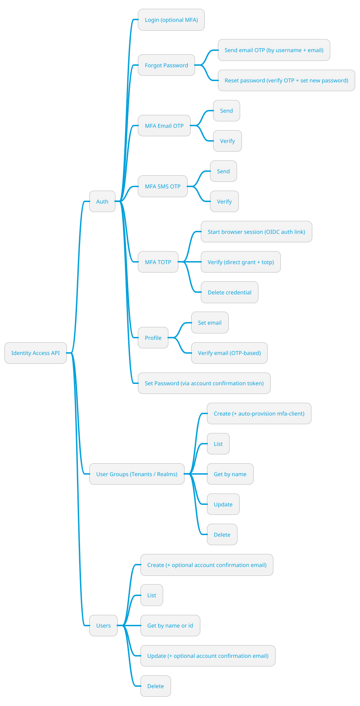
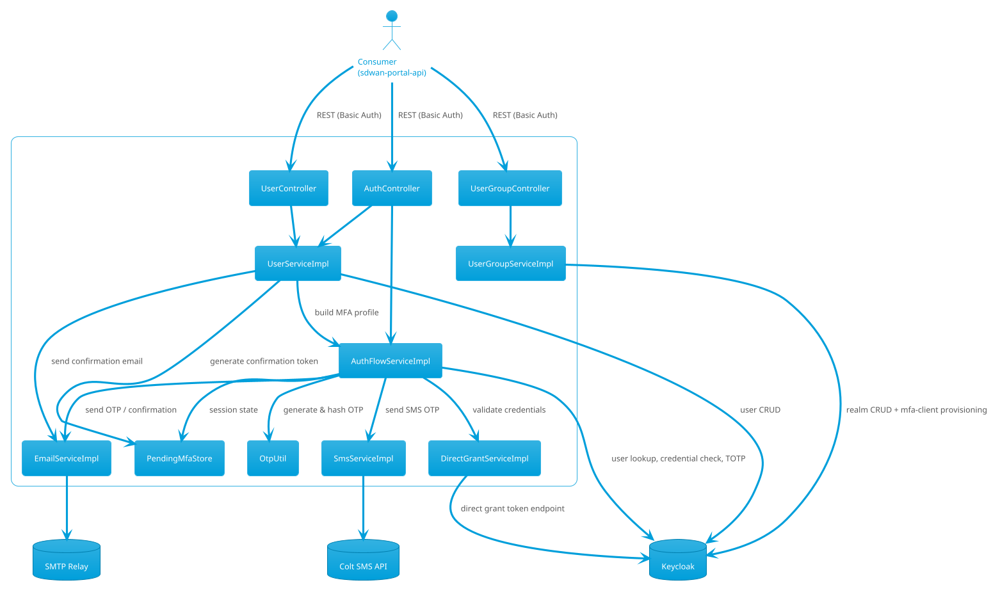
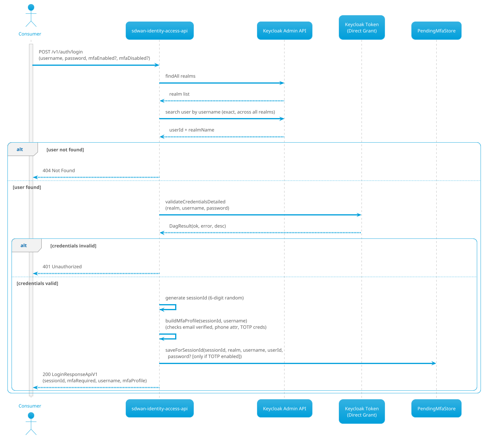
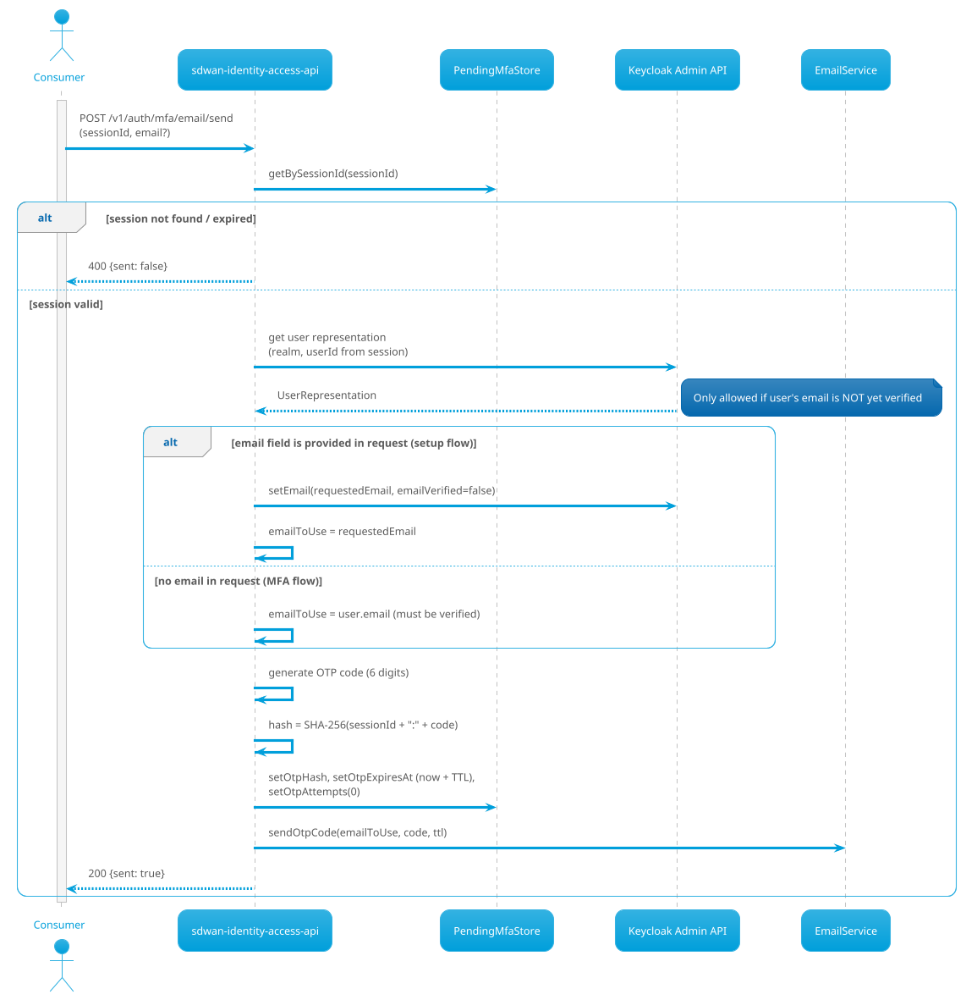
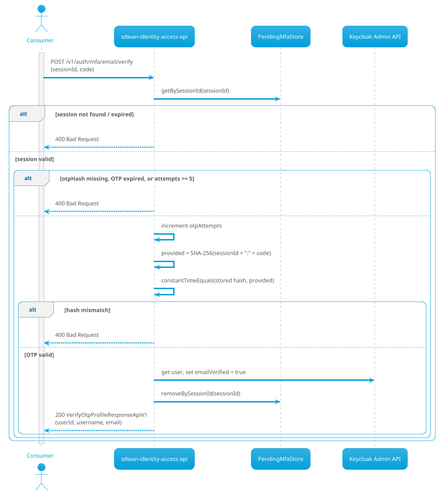
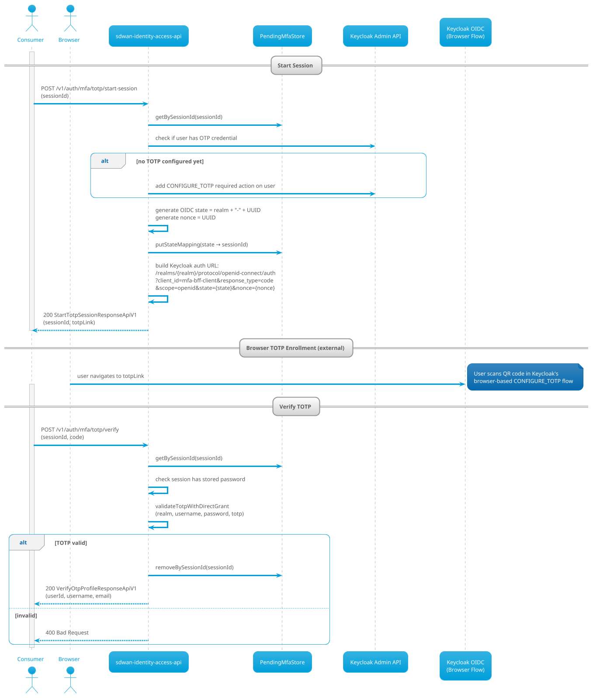
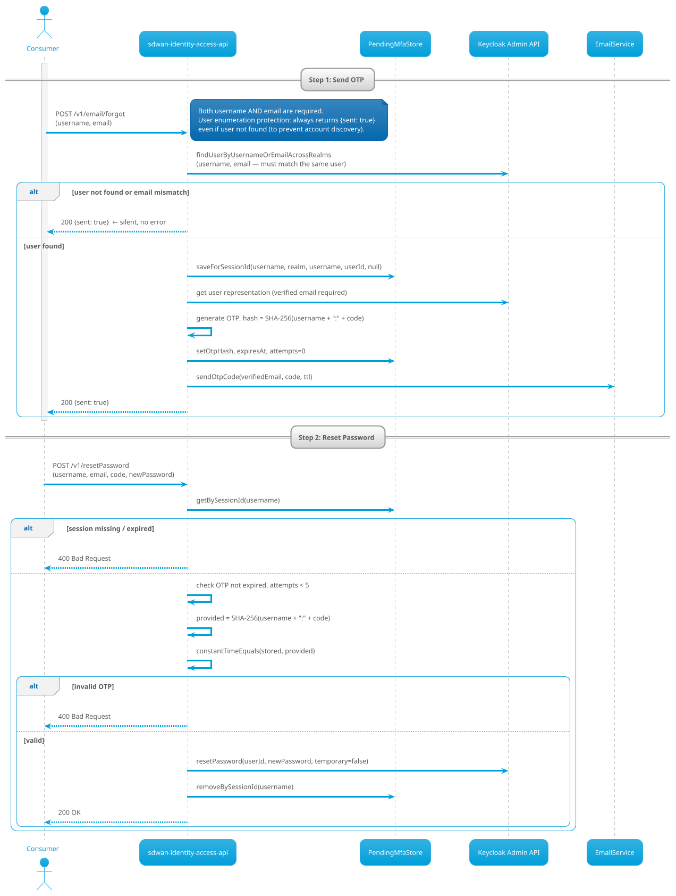
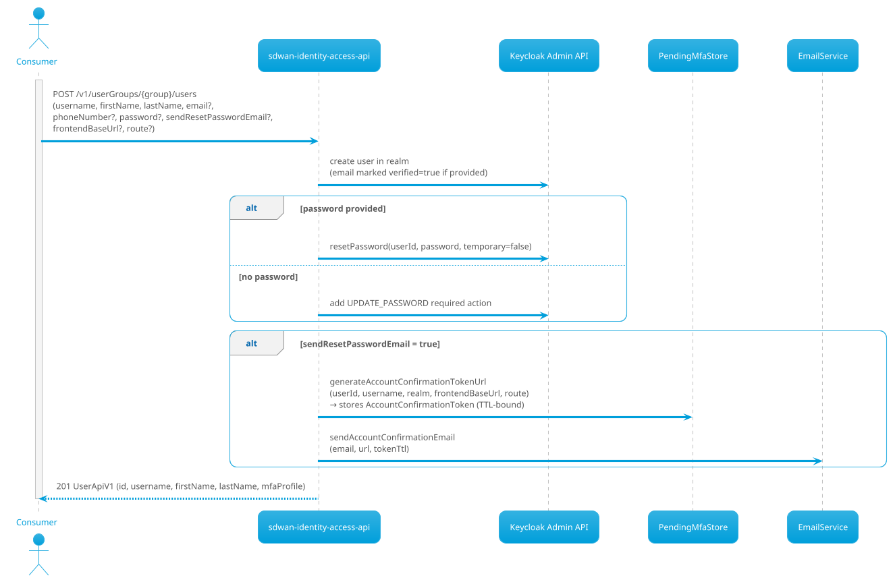

# SDWAN Identity Access API — Wiki

## Purpose

The objective of this microservice is to provide **Identity & Access Management** capabilities for the SD-WAN platform, acting as the backend adapter/orchestrator around **Keycloak** for:

- User group (realm/tenant) lifecycle management
- User lifecycle management inside a user group
- Authentication flows, including **optional MFA** (Email OTP / SMS OTP / TOTP)
- Forgot-password and account-confirmation email flows

This microservice exposes a set of operations used by upstream consumers (e.g. `sdwan-portal-api`) to manage tenants/users and authenticate them in a consistent way.

> **Important design note:** This API **does not issue JWT tokens**. After a successful MFA verification, it returns a `VerifyOtpProfileResponseApiV1` (userId, username, email). The upstream consumer is responsible for issuing its own session token from there.

---

## Tech Stack

| Layer | Technology |
|---|---|
| Language | Java 17 |
| Framework | Spring Boot 3.5.11 |
| Identity Provider | Keycloak 26.0.8 (Admin Client) |
| API Contract | OpenAPI 3.0 (code-generated via openapi-generator-maven-plugin 7.20.0) |
| SMS Gateway | Colt internal SMS API |
| Email | Spring Mail (SMTP relay) |
| Session Store | In-memory `ConcurrentHashMap` (TODO: replace with Redis) |
| Deployment | Kubernetes via Helm chart (multi-environment: sit, qa, demo, prod, rfs) |
| Build | Maven + Jib (containerisation) |

---

## Features Overview



---

## Architecture Overview



---

## Internal Component Details

### PendingMfaStore

An in-memory session store (`ConcurrentHashMap`) that manages three types of state across the authentication lifecycle:

| Map | Key | Value | Purpose |
|---|---|---|---|
| `attemptsBySessionId` | `sessionId` | `Attempt` | Tracks login sessions, OTP hashes, expiry, and attempt counts |
| `stateToSessionId` | OIDC `state` param | `sessionId` | Links the Keycloak OIDC auth flow back to the MFA session for TOTP |
| `accountConfirmationTokens` | random Base64 token | `AccountConfirmationToken` | Secure one-time links for password setup after user creation |

A scheduled task runs every 60 seconds (configurable via `pending-mfa.cleanup-delay-ms`) to purge expired entries.

> **TODO:** Replace `ConcurrentHashMap` with a distributed store (e.g., Redis) for horizontal scalability.

**Attempt fields:**

```
sessionId, realm, username, userId,
password (optional — only kept for TOTP via direct grant),
createdAt, expiresAt,
otpHash (SHA-256, salted with sessionId), otpExpiresAt, otpVerified, otpAttempts
```

### OtpUtil

- Generates cryptographically random 6-digit OTP codes via `SecureRandom`
- Hashes OTPs as `SHA-256(sessionId + ":" + code)` — sessionId acts as a per-session salt
- Compares hashes using constant-time equality to prevent timing attacks
- Max OTP attempts: **5** (hardcoded in `AuthFlowServiceImpl`)

### DirectGrantServiceImpl

Validates username/password (and optionally TOTP) by POSTing to Keycloak's `/realms/{realm}/protocol/openid-connect/token` with `grant_type=password`. Supports:
- `validateCredentials(realm, username, password)`
- `validateCredentialsWithTotp(realm, username, password, totp)`
- `validateCredentialsDetailed(...)` — returns structured `DagResult(ok, error, errorDescription)` for richer error handling

### Security

All endpoints are protected by **HTTP Basic Auth** (`spring.security.user.name/password`). Management/health endpoints are public. The API is stateless (no server-side HTTP sessions).

---

## API Endpoints

**Base path:** `/api` (context path) + versioned routes

### User Groups (Realms / Tenants)

| Method | Path | Description |
|---|---|---|
| `GET` | `/v1/userGroups` | List all user groups |
| `POST` | `/v1/userGroups` | Create a user group |
| `GET` | `/v1/userGroups/{user_group_name}` | Get user group by name or id |
| `PATCH` | `/v1/userGroups/{user_group_name}` | Update user group |
| `DELETE` | `/v1/userGroups/{user_group_name}` | Delete user group |

> Creating a user group also **auto-provisions** a `mfa-client` Keycloak client inside the new realm, with service-account + `realm-admin` role — this is what the auth flow uses later to manage users within that realm.

### Users

| Method | Path | Description |
|---|---|---|
| `GET` | `/v1/userGroups/{user_group_name}/users` | List users in a group |
| `POST` | `/v1/userGroups/{user_group_name}/users` | Create user |
| `GET` | `/v1/userGroups/{user_group_name}/users/{user_name}` | Get user by name or id |
| `PATCH` | `/v1/userGroups/{user_group_name}/users/{user_name}` | Update user |
| `DELETE` | `/v1/userGroups/{user_group_name}/users/{user_name}` | Delete user |

### Auth

| Method | Path | Description |
|---|---|---|
| `POST` | `/v1/auth/login` | Username/password login with optional MFA |
| `POST` | `/v1/auth/mfa/email/send` | Send email OTP |
| `POST` | `/v1/auth/mfa/email/verify` | Verify email OTP |
| `POST` | `/v1/auth/mfa/sms/send` | Send SMS OTP |
| `POST` | `/v1/auth/mfa/sms/verify` | Verify SMS OTP |
| `POST` | `/v1/auth/mfa/totp/start-session` | Get Keycloak OIDC link for TOTP enrollment |
| `POST` | `/v1/auth/mfa/totp/verify` | Verify TOTP code (direct grant) |
| `DELETE` | `/v1/auth/mfa/totp/delete` | Remove TOTP credential from user |
| `POST` | `/v1/auth/profile/email` | Set user email (during profile setup) |
| `POST` | `/v1/auth/profile/verify-email` | Send OTP to verify user email |
| `POST` | `/v1/email/forgot` | Forgot password — send email OTP |
| `POST` | `/v1/resetPassword` | Reset password using OTP + new password |
| `POST` | `/v1/set-password` | Set password via account confirmation token |

---

## Use Case Flows

### Login (username/password with optional MFA)

**`POST /v1/auth/login`**



**Key notes:**
- `username` is searched **across all Keycloak realms** — the consumer does not need to specify a realm/user-group.
- `mfaRequired` in the response is `true` when `mfaEnabled=true` (query param) AND `mfaDisabled` is not `true` in the body.
- The `mfaProfile` describes the state of each MFA method (email, sms, otp) for the user — each has `enabled`, `active`, and `value` fields.
- The `sessionId` is the key used for all subsequent MFA operations.
- The user's password is stored in the session **only** if TOTP is configured, so it can be verified later via direct grant.

---

### MFA Email OTP — Send

**`POST /v1/auth/mfa/email/send`**



---

### MFA Email OTP — Verify

**`POST /v1/auth/mfa/email/verify`**



---

### MFA SMS OTP — Send & Verify

**`POST /v1/auth/mfa/sms/send`** and **`POST /v1/auth/mfa/sms/verify`**

The SMS flow mirrors the Email OTP flow exactly, with these differences:
- Phone number is read from the Keycloak user attribute `phone_number` (E.164 format).
- There is no "setup mode" — the phone number must already be stored on the user.
- SMS is sent via the Colt SMS API (`SmsServiceImpl`), which parses the number using `libphonenumber`, splits it into country code + number, and POSTs to the external endpoint.
- `SmsService.wasSmsSent()` is checked and returned to the consumer.
- Verification logic (hash check, attempt count, TTL) is identical to email OTP.

---

### MFA TOTP — Start Session & Verify

**`POST /v1/auth/mfa/totp/start-session`** → **`POST /v1/auth/mfa/totp/verify`**



**Key notes:**
- The TOTP browser enrollment happens entirely in the user's browser via Keycloak's standard OIDC flow — this API only provides the redirect link.
- TOTP verification uses the Direct Grant flow (`validateCredentialsWithTotp`) — for this reason the user's plaintext password is temporarily stored in the `Attempt` session object (cleared on completion).
- There is **no OIDC callback endpoint** on this service — the browser completes the TOTP setup flow with Keycloak directly.

---

### TOTP Delete

**`DELETE /v1/auth/mfa/totp/delete`**

Finds the user across all realms by username, then iterates their Keycloak credential list and removes any credentials of type `otp`. Does not require a session — takes `{username}` in the request body.

---

### Profile — Set Email & Verify Email

**`POST /v1/auth/profile/email`** — Sets the user's email in Keycloak (marks `emailVerified=false`). Requires an active session.

**`POST /v1/auth/profile/verify-email`** — Sends an OTP to the user's current email and stores the hash in the session. On verification (via `email/verify`), marks the email as verified in Keycloak.

---

### Forgot Password Flow



**Key notes:**
- The session key for the forgot-password flow is the **username** (not a random sessionId), since no prior login session exists.
- The user lookup requires that **both username AND email match the same account** to prevent partial-knowledge attacks.

---

### User Creation with Account Confirmation Email

**`POST /v1/userGroups/{user_group_name}/users`**



### Set Password via Token

**`POST /v1/set-password?token={token}`**

Used by the user clicking the link from the account confirmation email:

1. The token is looked up in `PendingMfaStore.accountConfirmationTokens`
2. If valid (not expired, not already used), the password in the request body is set in Keycloak
3. The token is then consumed (removed from store)

---

## Data Models

### LoginResponseApiV1

```
{
  "mfaRequired": true,
  "username": "dragos.podariu",
  "session_id": "482913",
  "mfaProfile": {
    "session_id": "482913",
    "email": { "enabled": true, "active": true, "value": "d.p@example.com" },
    "sms":   { "enabled": true, "active": true, "value": "+40721234567" },
    "otp":   { "enabled": false, "active": false, "value": null }
  }
}
```

### MfaMethodApiV1

| Field | Meaning |
|---|---|
| `enabled` | The method is set up (email exists / phone exists / TOTP configured) |
| `active` | The method is usable (email is verified / phone exists / TOTP enrolled) |
| `value` | The masked value (email address, phone number, or null for TOTP) |

### VerifyOtpProfileResponseApiV1 (returned after successful MFA)

```
{
  "user_id": "abc-123-uuid",
  "username": "dragos.podariu",
  "email": "d.p@example.com"
}
```

No JWT is issued — the upstream consumer uses this to establish its own session.

### UserApiV1

```
{
  "id": "abc-123-uuid",
  "username": "dragos.podariu",
  "firstName": "Dragoș",
  "lastName": "Podariu",
  "mfaProfile": { ... }
}
```

The `mfaProfile` is always populated in user responses (email/sms/otp method state).

---

## Configuration Reference

| Property | Default / Example | Description |
|---|---|---|
| `keycloak.server-url` | `http://qa.keycloak...` | Keycloak base URL |
| `keycloak.realm` | `master` | Realm for admin client login |
| `keycloak.username` / `password` | `keycloak` / `keycloak` | Admin credentials |
| `keycloak.client-id` | `admin-cli` | Admin CLI client |
| `login.client-id` | `mfa-frontend-client` | Client used for Direct Grant credential validation |
| `login.client-secret` | `...` | Secret for login client |
| `browser.client-id` | `mfa-bff-client` | Client used for TOTP browser OIDC flow |
| `otp.ttl.minutes` | `5` | OTP expiry duration |
| `token.ttl.minutes` | _(set in config)_ | Account confirmation token TTL |
| `pending-mfa.cleanup-delay-ms` | `60000` | Interval for purging expired sessions |
| `sms.api.url` | Colt SMS API endpoint | External SMS gateway URL |
| `sms.api.security.token` | `...` | Auth token for SMS API |
| `email.from` | `donotreply@colt.net` | From address for all emails |
| `spring.security.user.name/password` | `admin` / `admin` | HTTP Basic auth credentials for the API |

---

## Keycloak Realm Provisioning

When a **User Group** (realm) is created via `POST /v1/userGroups`, the service:

1. Creates the Keycloak realm (enabled, with displayName)
2. Automatically creates a `mfa-client` Keycloak client inside it:
   - `serviceAccountsEnabled: true`, `publicClient: false`
   - Direct access grants: **disabled** (service accounts only)
3. Grants the service account the `realm-admin` role (via `realm-management` client)

This provisioning ensures every realm is immediately ready for user management by the identity service.

---

## Security Considerations

- **OTP hashing:** Codes are never stored in plaintext. SHA-256 is computed with the sessionId as a salt.
- **Constant-time comparison:** Hash comparisons use XOR-based constant-time equality to prevent timing side-channels.
- **Max attempts:** OTP verification is capped at 5 attempts per session; further attempts return 400.
- **User enumeration protection:** The forgot-password endpoint always returns `{sent: true}`, regardless of whether the user was found.
- **Token security:** Account confirmation tokens are 32 random bytes (Base64url encoded), generated via `SecureRandom`, with collision-safe `putIfAbsent` insertion.
- **TOTP password storage:** The user's plaintext password is stored in the in-memory session *only* when TOTP is configured, and is cleared immediately after verification.
- **API authentication:** All endpoints require HTTP Basic Auth. Management endpoints (`/management/**`) are public.
